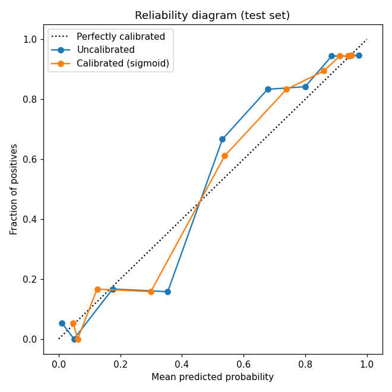

# Model Card: Heart Disease Risk Model

> **Educational project. Not a medical device and not for clinical use.**
> This model was built to demonstrate an end-to-end MLOps workflow. It must not
> be used to make or inform real health decisions.

## Model details

- **Type:** RandomForestClassifier (selected over GradientBoosting and XGBoost
  by 5-fold cross-validated ROC-AUC).
- **Version:** 1.2
- **Hyperparameters:** `n_estimators=400`, `max_depth=None`, `min_samples_leaf=2`
  (tuned with `GridSearchCV` on ROC-AUC).
- **Calibration:** probabilities are calibrated with Platt scaling
  (`CalibratedClassifierCV`, sigmoid, 5-fold). The uncalibrated tree model is
  retained only to compute SHAP attributions.
- **Inputs:** 11 clinical features (age, sex, chest pain type, resting blood
  pressure, cholesterol, fasting blood sugar, resting ECG, max heart rate,
  exercise angina, oldpeak, ST slope).
- **Output:** calibrated probability of heart disease (`risk_score`) and a
  binary prediction at a **0.5** threshold, with per-prediction SHAP attributions.

## Intended use

- **In scope:** demonstrating model serving, explainability, and monitoring on a
  well-known benchmark dataset; learning and portfolio purposes.
- **Out of scope:** any real clinical, diagnostic, insurance, or screening
  decision. The model is trained on a small public dataset and has not been
  validated on any real-world population.

## Training data

- Combined UCI heart-disease dataset: 918 rows after de-duplication, split 80/20
  stratified (`random_state=42`) into 734 train / 184 test.
- **Data-quality handling:** in the source data a value of `0` for `cholesterol`
  (18.7% of rows) or `resting_bp_s` encodes a *missing* measurement, not a real
  reading. Left untreated this leaks a spurious signal: rows with missing
  cholesterol have an 88% disease rate versus 55% overall, so the model would
  learn "cholesterol field is blank" rather than a clinical relationship. These
  zeros are replaced with the **training-set median** (`cholesterol=238`,
  `resting_bp_s=130`), fit on the training split only and applied identically at
  serve time to avoid train/serve skew. `oldpeak=0` is a legitimate clinical
  value and is deliberately left unchanged.

## Performance (held-out test set, n=184)

| Metric | Value |
|---|---|
| Accuracy | 0.891 |
| ROC-AUC | 0.927 |
| Precision | 0.887 |
| Recall | 0.922 |
| F1 | 0.904 |

Removing the missing-value leakage described above changed ROC-AUC only
marginally (0.932 → 0.927), which indicates the model's signal comes from
genuine features (ST slope, chest pain type, exercise angina) rather than the
data artifact.

### Calibration

RandomForest vote fractions are not well-calibrated probabilities, so the raw
`predict_proba` is better read as a ranking. Platt scaling reduces the Brier
score on the test set from **0.102 (uncalibrated) to 0.098 (calibrated)**;
ROC-AUC is unchanged because calibration is a monotonic transform. The
reliability diagram below compares the two.

## Fairness analysis (by sex)

| Subgroup | n | Positive rate | Accuracy | ROC-AUC | Recall |
|---|---|---|---|---|---|
| Female | 38 | 0.158 | 0.947 | 0.948 | 0.833 |
| Male | 146 | 0.658 | 0.877 | 0.906 | 0.927 |

**Concerns:**

- **Representation:** the data is heavily skewed toward men (79% of the test
  set), and the female subgroup (n=38, ~6 positive cases) is too small for
  reliable metric estimates.
- **Recall gap:** female recall (0.833) is lower than male recall (0.938),
  meaning the model misses proportionally more true-positive women. On this
  sample size the estimate is noisy, but the direction is a known risk in
  cardiac models and would need a larger, balanced dataset to assess properly.
- The base rates differ sharply between groups (16% vs 66%), so a single global
  threshold does not treat the groups equivalently.

## Limitations

- **Uncalibrated probabilities:** `risk_score` is the raw RandomForest
  `predict_proba` output and has not been calibrated, so it should be read as a
  relative ranking, not a true probability.
- **Fixed 0.5 threshold:** not tuned for any clinical cost trade-off (in a real
  setting, false negatives usually cost far more than false positives).
- **No performance monitoring:** the drift monitor compares input distributions
  only. Detecting *accuracy* drift requires ground-truth outcomes, which this
  system does not collect.
- **Small, non-representative data:** results will not transfer to a real
  patient population.

## Ethical considerations

- A false negative (missing real disease) is the most harmful error mode and is
  not adequately controlled by the current threshold.
- The model must never be presented to a patient or clinician as a diagnosis.
- Any real deployment would require calibration, a justified decision threshold,
  subgroup validation on a representative population, and regulatory review.
